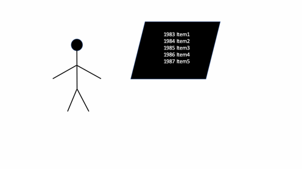

 [](https://github.com/Techtonique/techtonique_apis/blob/master/LICENSE) [](https://pepy.tech/project/techtonique_apis) 

# techtonique_apis

High level Python functions for interacting with [Techtonique APIs](https://www.techtonique.net)



## 1 - Installation

```bash
pip install techtonique_apis
```

## 2 - Usage 

2 types of usage, in Python or in Excel

## 2 - 1 - Python

- File examples: [https://github.com/Techtonique/datasets/tree/main/time_series](https://github.com/Techtonique/datasets/tree/main/time_series)
- Get a token: [https://www.techtonique.net/token](https://www.techtonique.net/token) (store in .env, in current directory as `TECHTONIQUE_TOKEN`)

```python
from techtonique_apis import TechtoniqueAPI

api = TechtoniqueAPI()


# Example 1: Forecasting
forecast_result = api.forecasting(
    file_path="/Users/t/Documents/datasets/time_series/univariate/a10.csv",
    base_model="RidgeCV",
    n_hidden_features=5,
    lags=25,
    type_pi="kde",
    replications=10,
    h=5
)
print("Forecasting result:", forecast_result)


# Example 2: Machine Learning Regression
regression_result = api.mlregression(
    file_path="/Users/t/Documents/datasets/tabular/regression/mtcars2.csv",
    base_model="ElasticNet",
    n_hidden_features=5,
    return_pi=True
)
print("Regression result:", regression_result)

# Example 3: Reserving
reserving_result = api.reserving(
    file_path="/Users/t/Documents/datasets/tabular/triangle/raa.csv",
    method="chainladder"
)
print("Reserving result:", reserving_result)


# Example 4: Survival Analysis
survival_result = api.survival_curve(
    file_path="/Users/t/Documents/datasets/tabular/survival/kidney.csv",
    method="km",
    patient_id=123
)
print("Survival curve result:", survival_result)
```

See [examples/example.py](./examples/example.py)


## 2 - 2 - Excel

- [https://thierrymoudiki.github.io/blog/2025/07/02/r/python/techto-forecast](https://thierrymoudiki.github.io/blog/2025/07/02/r/python/techto-forecast)
- [https://thierrymoudiki.github.io/blog/2025/07/07/r/python/techto-ml-classif](https://thierrymoudiki.github.io/blog/2025/07/07/r/python/techto-ml-classif)
- [https://thierrymoudiki.github.io/blog/2025/07/06/r/python/techto-ml](https://thierrymoudiki.github.io/blog/2025/07/06/r/python/techto-ml)
- [https://github.com/Techtonique/techtonique-apis/blob/main/examples/excel_formulas.xlsx](https://github.com/Techtonique/techtonique-apis/blob/main/examples/excel_formulas.xlsx)

## License

MIT 

